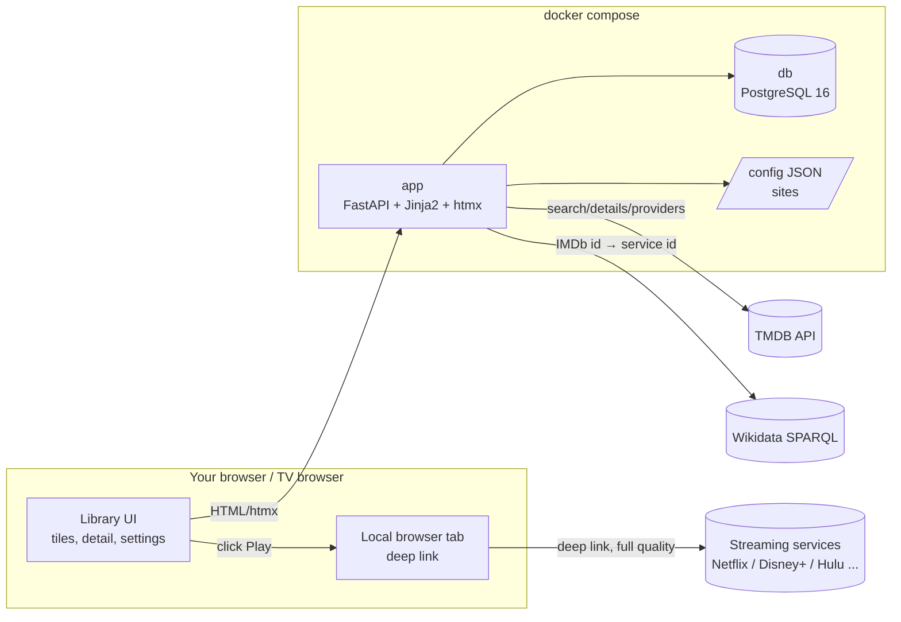

# StreamDeck — Design Document

A personal, Dockerized launcher/harness for paid streaming services. The household curates a
shared library of titles; the app shows them as tiles, gives a detail view, and plays them
through the services' own signed-in web players by deep-linking to the local browser.
Netflix-style profiles keep per-person watch state, watch lists, and kid-mode limits.

## Goals

- Tile-grid library → detail view → Play → the title open in the service's own player.
- Metadata (title, poster, description, runtime, year, ratings, certification) stored
  locally in PostgreSQL, fetched from the TMDB API in the household's chosen language and
  filtered to its watch region.
- Playback always happens through the streaming service's own player, signed in to the
  user's paid account.
- Household profiles: per-profile watched state (including per-episode TV tracking), watch
  lists, and optional kid-mode controls behind a parent PIN.
- Home LAN, no app accounts, `docker compose up`.

## Non-goals / hard rules

- **No downloading or capturing of media.** Nothing is written to disk except the app database.
- **No DRM circumvention, no attestation/integrity spoofing.**
- **No credential storage.** Sign-in is the owner's own browser session with each
  service; the app never stores or handles account credentials.
- **No crawling/scraping of streaming sites.** Metadata comes from the TMDB API; availability
  comes from the TMDB/JustWatch watch-provider data; direct title links come from Wikidata's
  public streaming-id catalogue (e.g. Netflix ID P1874), with the site's search page as the
  fallback. Service pages are only ever opened to *play* content as a normal signed-in
  browser would.

## Architecture

### Components

| Container | Image | Role |
|---|---|---|
| `app` | local build (`python:3.12-slim`) | FastAPI backend + server-rendered UI (Jinja2, Tailwind CDN, htmx) |
| `db` | `postgres:16-alpine` | Profiles, preferences, services, and the title library |

## Playback model

Every title's Play is a plain link that opens the title's `deep_link` in *your local* browser
tab — full quality (Edge/Chrome on Windows negotiate PlayReady up to 4K). The `deep_link` is
resolved when the title is added: the exact URL you paste for a manual add, otherwise a
direct service page resolved from Wikidata's public streaming-id catalogue (IMDb id →
service title id, best effort), falling back to the service's search page. Custom sites can
be marked search-links-only to skip resolution entirely.

### Sign-in

The user signs in to each service **once, manually**, in their own browser — the same browser
that opens the deep links, so cookies are already present. The app stores no credentials
(an earlier convenience-vault design was dropped: the browser session is the sign-in).

## Metadata: TMDB

- Free API key in `.env` (`TMDB_API_KEY`).
- **Add-item flow:** paste the streaming URL → app detects the service from the domain →
  user types the title and picks the right match from TMDB `search/multi` results → app
  fetches details (`/movie/{id}` or `/tv/{id}`) plus external ids (IMDb) and US
  certification, and stores everything locally. No streaming site is ever fetched by the
  server.
- **Bulk preload ("Add all"):** discovers popular titles for a site's TMDB provider id in
  the configured region, fetches details, batch-resolves deep links via Wikidata, and
  inserts in committed batches — with live progress and a stop button.
- **Discover page:** TMDB-powered browsing of titles not yet in the library, with trailers
  and one-click add.
- **Localization:** all TMDB text is fetched in the app-wide metadata language; the library
  is filtered to the app-wide watch region using TMDB/JustWatch watch-provider data
  (per-title `regions`).
- **Availability refresh:** a startup/weekly pass re-checks watch-provider data, marking
  titles a service no longer streams (`unavailable_since`) and surfacing Coming Soon /
  leaving banners.
- Startup backfills fill in details, deep links, and availability for titles added before
  those fields existed.

## Profiles, kid mode, and the parent PIN

- Profiles are Netflix-style: the library is shared, but watched state, per-episode TV
  tracking, and My List are per profile, keyed by `(tmdb_id, media_type)` so the same title
  on several services counts once.
- Kid-mode controls per profile: a unified US movie/TV age-rating cap
  (`max_rating_level`), an allowed-services list, and a `kid_mode` flag that hides mature
  and over-cap titles.
- A parent PIN (stored only as a salted hash in `app_prefs`) locks settings and profile
  switching; unlocking issues a short-lived signed token, after which the lock re-engages.

## App-wide preferences

TMDB metadata language, watch region, display theme, and the parent-PIN hash live in the
`app_prefs` table (one JSON-encoded value per key), cached in memory and written only on
settings changes. A `prefs.json` left over from a pre-database install is imported once on
first use, then ignored. The site registry stays in `config/sites.json` (human-editable,
synced into the `services` table on startup).

## Data model

- `services`: `id`, `name`, `slug`, `base_domain`, `icon_path`, `enabled`. Synced on
  startup from `config/sites.json`.
- `titles`: `id`, `service_id→services`, `tmdb_id`, `media_type` (`movie|tv`), `title`,
  `overview`, `poster_url`, `backdrop_url`, `runtime_minutes`, `release_year`, `genres`,
  `mature`, `rating`, `vote_count`, `popularity`, `certification`, `imdb_id`, `regions`,
  `unavailable_since`, `deep_link`, `added_at`.
- `profiles`: `id`, `name`, `max_rating_level`, `allowed_services`, `kid_mode`, `created_at`.
- `profile_watch` / `profile_list_items`: per-profile watched state and My List, keyed by
  `(tmdb_id, media_type)`.
- `profile_episode_watch`: per-profile watched episodes, keyed by `(tmdb_id, season, episode)`.
- `app_prefs`: `key`, JSON-encoded `value` (language, region, theme, PIN hash, token
  signing key).

Schema is created with `create_all` on startup; additive/removal column changes are applied
with small idempotent `ALTER`s in `_init_db`. Alembic can be introduced when the schema
churns more.

## Routes

Pages (server-rendered):

| Route | Purpose |
|---|---|
| `GET /` | Tile grid with filters, search, sorting (incl. Bayesian weighted rating), select mode |
| `GET /discover` | TMDB discovery: browse and add titles, watch trailers |
| `GET /add` | Add-item flow (paste URL → TMDB search → confirm) |
| `GET /titles/{id}` | Detail view (backdrop hero, metadata, IMDb link, Play/trailer buttons) |
| `GET /titles/{id}/episodes/{season}` | Season episode list with per-episode watched toggles |
| `GET /settings` | App settings: language, region, theme customizer, profiles, PIN |
| `GET /sites` | Site registry management |
| `GET /profiles/menu` | Profile switcher (htmx partial) |
| `GET /manifest.json`, `GET /icons/{slug}.svg` | PWA manifest and site icons |
| `GET /healthz` | Liveness (JSON) |

htmx API (under `/api`): URL resolution and title CRUD (`/resolve-url`, `/titles`,
`/titles/bulk`, `/discover/add`), watched and My List toggles (`/titles/{id}/watched`,
`/titles/{id}/list`, `/episodes/toggle`, `/episodes/season`), profile management
(`/profiles`, `/profiles/{id}/activate`), kid-mode settings and PIN lock/unlock
(`/settings/*`, `/pin/lock`, `/pin/unlock`), app preferences (`/settings/theme`,
`/settings/region`, `/settings/language`), and site CRUD plus the bulk preload with stop
control (`/sites`, `/sites/{slug}/preload`, `/sites/{slug}/preload/stop`).

## Front end

Server-rendered Jinja2 + Tailwind (CDN) + htmx — no JavaScript build step. Notable behavior:

- **Keyboard & spatial navigation:** arrow keys move focus between tiles and controls
  (TV-remote friendly), number keys switch nav tabs, single-key shortcuts per page, and a
  `?` help overlay. Shortcuts never fire while typing.
- **Library QoL:** bulk select mode (mark watched/unwatched, remove), toasts, lazy-loaded
  posters with a grid count, and scroll restore on back-navigation.
- **PWA:** a web-app manifest with icons makes the app installable in standalone display
  mode.

## Security posture

No app login — the trust boundary is the home LAN. State-changing requests pass a
same-origin guard middleware; the parent PIN is stored only as a salted hash and unlocks
via a short-lived signed token. Pylint and a pytest suite (no database required) gate every
commit via a pre-commit hook and GitHub Actions.

## Risks and accepted limits

- **Quality:** playback quality is whatever the service negotiates in your own browser — no
  container ceiling, since nothing plays inside the container.
- **Bot detection:** because you sign in and play in your normal browser, there is no unusual
  environment for services to challenge.
- **Runtime internet:** Tailwind/htmx CDNs, TMDB, and Wikidata require outbound internet.

## Milestones

- **M0** — this document. ✅
- **M1** — library core: `app`+`db` compose, models/seed, TMDB client, add flow, tiles + detail. ✅
- **M2** — deep-link playback, watched tracking. ✅
- **M3** — direct deep-link resolution (Wikidata streaming-id catalogue). ✅
- **M4** — polish: filters, README. ✅ (the credentials helper was dropped by design)
- **M5** — household: profiles, kid mode, parent PIN. ✅
- **M6** — discovery & freshness: Discover page, trailers, region availability, weekly
  refresh, Coming Soon / leaving banners. ✅
- **M7** — TV: per-episode tracking, season views. ✅
- **M8** — UX: settings page + themes, PWA, keyboard/spatial nav, bulk select. ✅
- **M9** — hardening: same-origin guard, hashed PIN, lint + test gates. ✅
