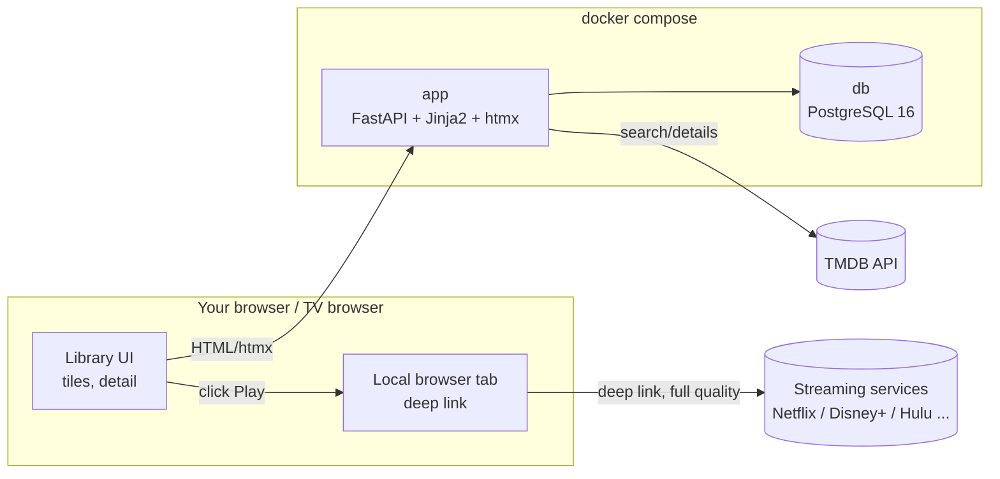

# StreamDeck — Design Document

A personal, Dockerized launcher/harness for paid streaming services. You curate a library of
titles; the app shows them as tiles, gives a detail view, and plays them through the services'
own signed-in web players by deep-linking to your local browser.

## Goals

- Tile-grid library → detail view → Play → the title open in the service's own player.
- Metadata (title, poster, description, runtime, year) stored locally in PostgreSQL.
- Playback always happens through the streaming service's own player, signed in to the
  user's paid account.
- Single user, home LAN, `docker compose up`.

## Non-goals / hard rules

- **No downloading or capturing of media.** Nothing is written to disk except the app database.
- **No DRM circumvention, no attestation/integrity spoofing.**
- **No credential storage.** Sign-in is the owner's own browser session with each
  service; the app never stores or handles account credentials.
- **No crawling/scraping of streaming sites.** Metadata comes from the TMDB API; deep links
  resolve via the TMDB/JustWatch watch-provider data. Service pages are only ever opened to
  *play* content as a normal signed-in browser would.

## Architecture

### Components

| Container | Image | Role |
|---|---|---|
| `app` | local build (`python:3.12-slim`) | FastAPI backend + server-rendered UI (Jinja2, Tailwind CDN, htmx) |
| `db` | `postgres:16-alpine` | Library metadata |

## Playback model

Every title's Play is a plain link that opens the title's `deep_link` in *your local* browser
tab — full quality (Edge/Chrome on Windows negotiate PlayReady up to 4K). The `deep_link` is
resolved when the title is added: the exact URL you paste for a manual add, or a direct
service page (via TMDB/JustWatch watch-provider data) for bulk "Add all" preloads, falling
back to the service's search page.

### Sign-in

The user signs in to each service **once, manually**, in their own browser — the same browser
that opens the deep links, so cookies are already present. The app stores no credentials
(an earlier convenience-vault design was dropped: the browser session is the sign-in).

## Metadata: TMDB

- Free API key in `.env` (`TMDB_API_KEY`).
- **Add-item flow:** paste the streaming URL → app detects the service from the domain →
  user types the title and picks the right match from TMDB `search/multi` results → app
  fetches details (`/movie/{id}` or `/tv/{id}`) and stores everything locally. No streaming
  site is ever fetched by the server.

## Data model

- `services`: `id`, `name`, `slug`, `base_domain`, `icon_path`, `enabled`. Seeded on first
  startup from `config/sites.json`.
- `titles`: `id`, `service_id→services`, `tmdb_id`, `media_type` (`movie|tv`), `title`,
  `overview`, `poster_url`, `backdrop_url`, `runtime_minutes`, `release_year`, `deep_link`,
  `watched`, `added_at`, `last_played_at`.

Schema is created with `create_all` on startup; additive/removal column changes are applied
with small idempotent `ALTER`s in `_init_db`. Alembic can be introduced when the schema
churns more.

## Routes

| Route | Kind | Purpose |
|---|---|---|
| `GET /` | page | Tile grid; `?service=` and `?watched=` filters |
| `GET /add` | page | Add-item flow (paste URL → TMDB search → confirm) |
| `GET /titles/{id}` | page | Detail view (backdrop hero, metadata, Play buttons) |
| `POST /api/resolve-url` | htmx | Detect service from pasted URL + TMDB search results partial |
| `POST /api/titles` | htmx | Create title from a chosen TMDB match |
| `PATCH /api/titles/{id}/watched` | htmx | Toggle watched |
| `DELETE /api/titles/{id}` | htmx | Remove from library |
| `GET /healthz` | JSON | Liveness |

## Risks and accepted limits

- **Quality:** playback quality is whatever the service negotiates in your own browser — no
  container ceiling, since nothing plays inside the container.
- **Bot detection:** because you sign in and play in your normal browser, there is no unusual
  environment for services to challenge.
- **Runtime internet:** Tailwind/htmx CDNs and TMDB require outbound internet.

## Milestones

- **M0** — this document.
- **M1** — library core: `app`+`db` compose, models/seed, TMDB client, add flow, tiles + detail.
- **M2** — deep-link playback, watched tracking.
- **M3** — direct deep-link resolution via TMDB/JustWatch watch-provider data.
- **M4** — polish: credentials helper, filters, README.
