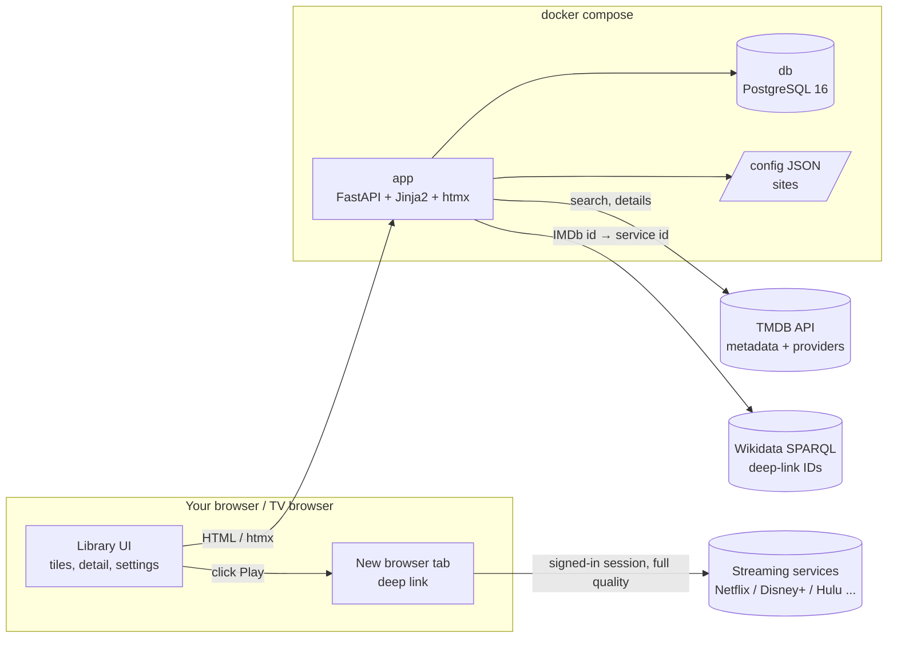
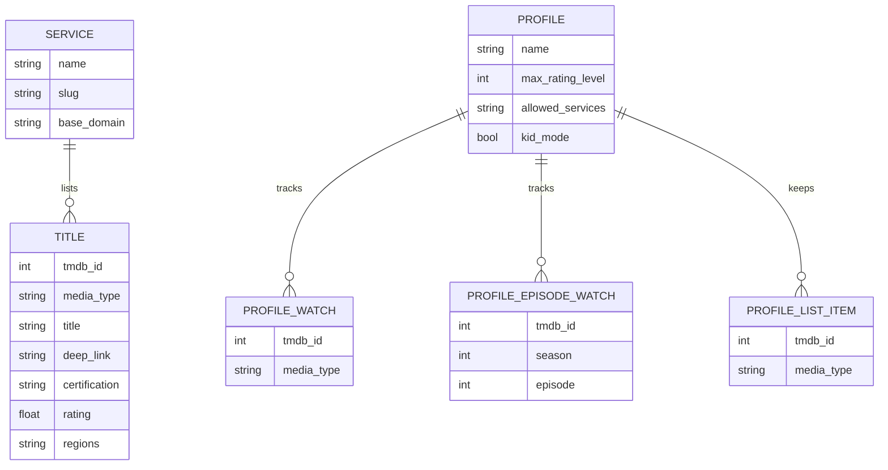
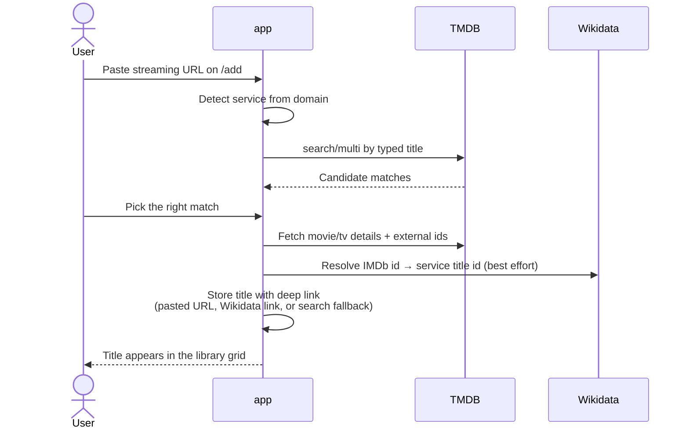
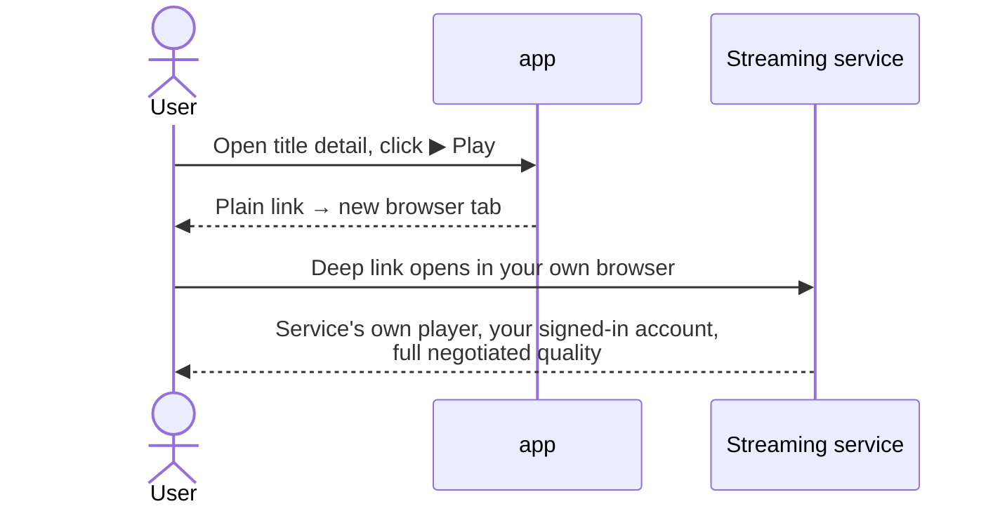

# StreamDeck

## Project overview

StreamDeck is a personal, self-hosted launcher for the paid streaming services you already
subscribe to. It gives you one Netflix-style library across all of your services: curate
titles with artwork and details, browse them as tiles, and press Play to open each title in
the service's own signed-in web player, deep-linked into your local browser at full quality.

**Nothing is downloaded, no DRM is circumvented, no sites are scraped, and no streaming
credentials are ever stored.** See [DESIGN.md](DESIGN.md) for the full design document.

## Description

The app runs as two Docker containers (a FastAPI web app and PostgreSQL) on your home LAN —
no accounts, no sign-in, just open the page. The library is shared by everyone in the
household; profiles (like Netflix profiles) keep separate watch state and watch lists, with
optional kid-mode controls: a per-profile age-rating cap, a per-profile allowed-services
list, and a parent PIN that locks settings and profile switching.

Titles are added by pasting a streaming URL (the service is detected from the domain) or in
bulk via each site's "Add all" preload, which discovers popular titles on that provider.
Metadata — posters, descriptions, runtime, ratings, certifications — comes from the TMDB API,
localized to your chosen language and filtered to your region. Direct per-title deep links
are resolved from Wikidata's public streaming-ID catalogue where available, falling back to
the service's search page.

## Install and run

Prerequisites: Docker with the Compose plugin, and a free TMDB API key
([themoviedb.org](https://www.themoviedb.org/settings/api)).

```bash
git clone <this repo> && cd streamDeck

cp .env.example .env
# Edit .env: set TMDB_API_KEY and a real POSTGRES_PASSWORD.

docker compose up -d --build
```

Then open **http://localhost:8000** and start adding titles. Sign in to each streaming
service once in the same browser — deep links then open already authenticated.

To stop: `docker compose down` (add `-v` to also delete the library database).

## Keyboard controls

Press `?` on any page for this overlay. Shortcuts never fire while typing in a field.

| Where | Key | Action |
|---|---|---|
| Library | `←` `→` `↑` `↓` | Move between tiles (TV-remote friendly) |
| Library | `Enter` | Open the selected title |
| Library | `/` | Search the library |
| Library | `f` | Toggle the filters & search drawer |
| Library | `a` | Add a title |
| Library | `s` | Select mode — pick tiles, then bulk mark watched/unwatched or remove |
| Title page | `p` | Play on the default service |
| Title page | `t` | Play the trailer |
| Title page | `w` | Toggle watched |
| Title page | `l` | Toggle my list |
| Title page | `Backspace` | Back to the library |
| Anywhere | `←` `→` `↑` `↓` | Move focus between controls (spatial navigation) |
| Anywhere | `1` `2` `3` | Go to Discover / Browse / Sites |
| Anywhere | `Esc` | Close menus & overlays |

## Development

Tests live in [`tests/`](tests/) (pytest, no database needed) and linting is
pylint, both configured in [`pyproject.toml`](pyproject.toml). One-time setup:

```bash
python3 -m venv .venv
.venv/bin/pip install -r requirements-dev.txt

# Run lint + tests on every commit (the hook lives in .githooks/):
git config core.hooksPath .githooks
```

Run them directly with `.venv/bin/python -m pytest` and
`.venv/bin/python -m pylint app tests`. The pre-commit hook runs both and
blocks the commit if either fails; bypass in an emergency with
`git commit --no-verify`.

## Dependencies

Python packages (pinned in [`app/requirements.txt`](app/requirements.txt)):

| Package | Role |
|---|---|
| `fastapi` | Web framework (async) |
| `uvicorn[standard]` | ASGI server |
| `sqlalchemy[asyncio]` + `asyncpg` | Async ORM and PostgreSQL driver |
| `httpx` | Async HTTP client for TMDB and Wikidata |
| `jinja2` | Server-rendered HTML templates |
| `pydantic-settings` | Typed settings from environment variables |
| `python-multipart` | Form parsing |

External services (outbound internet required at runtime):

- **TMDB API** — all title metadata and watch-provider availability. Free API key.
- **Wikidata SPARQL endpoint** — best-effort direct deep-link resolution.
- **Tailwind / htmx CDNs** — front-end assets loaded by the browser.

Infrastructure: `postgres:16-alpine` and a local image built on `python:3.12-slim`.

## Tech stack

- **Backend:** Python 3.12, FastAPI, SQLAlchemy 2 (async) on PostgreSQL 16
- **Frontend:** Server-rendered Jinja2 templates, Tailwind CSS (CDN), htmx for partial
  updates — no JavaScript build step; installable as a PWA (web-app manifest)
- **Metadata:** TMDB REST API; Wikidata SPARQL for deep links
- **Config:** `config/sites.json` (site registry), volume-mounted at `/data`; app-wide
  preferences (language, region, theme, parent PIN) live in the database
- **Deployment:** Docker Compose, single host, home LAN

## Design principles

- **Play through the service, never around it.** Playback always happens in the service's
  own web player, in your own browser, signed in to your paid account. Nothing is downloaded
  or captured; no DRM or attestation is touched. Quality is whatever your browser negotiates
  (Edge/Chrome on Windows reach PlayReady 4K).
- **No credentials, ever.** There is no app login, and streaming sign-in is your own
  browser session with each service — the app never sees or stores a password.
- **No scraping.** Metadata comes from the TMDB API; availability from TMDB/JustWatch
  watch-provider data; deep links from Wikidata's public catalogue. Streaming sites are only
  ever opened to play content, as a normal browser would.
- **Simple to operate.** One `docker compose up`, schema created on startup with small
  idempotent migrations, human-editable JSON config (edits to `sites.json` apply on
  restart).
- **Household-friendly.** Per-profile watch state and watch lists, unified US movie/TV
  age-rating levels for kid profiles, and a short-lived parent-PIN unlock.

## Architecture overview

Two containers behind Docker Compose:

| Container | Image | Role |
|---|---|---|
| `app` | local build (`python:3.12-slim`) | FastAPI backend + server-rendered UI (Jinja2, Tailwind, htmx) |
| `db` | `postgres:16-alpine` | Profiles, preferences, services, and the title library |

The `app` container is organized as:

- **`routers/pages.py`** — HTML pages: library grid (`/`) with filters, search, and sorting
  (including a Bayesian weighted rating sort), TMDB discovery (`/discover`), the add flow
  (`/add`), title detail with season episode lists, settings (`/settings`), sites
  management (`/sites`), and the PWA manifest.
- **`routers/api.py`** — htmx endpoints: URL resolution, title CRUD, watched/watch-list
  toggles, profile and settings management, PIN lock/unlock, site CRUD, and the bulk
  "Add all" preload with a stop control.
- **`profiles.py` / `prefs.py`** — active-profile resolution and content policy (rating
  caps, kid mode, PIN), plus app-wide preferences (TMDB language, region, theme) stored
  in the `app_prefs` table.
- **`sites.py`** — the site registry backed by `config/sites.json`, synced into the
  `services` table on startup.
- **`tmdb.py` / `wikidata.py`** — external metadata clients.
- **`models.py` / `db.py`** — ORM models and async engine setup.

Data model in brief: `services` (streaming sites) have `titles` carrying TMDB metadata and
a resolved `deep_link`; `profiles` hold per-person watch state (including per-episode TV
tracking) and watch lists keyed by TMDB id, so the same title across several services
counts once.

## Architecture diagrams

System context:



Data model:



Watch state references titles by `(tmdb_id, media_type)` rather than by row, matching how
the library groups the same title across services into one tile.

## Process flow

Adding a title:



Playing a title:



Bulk preload ("Add all" on a site) follows the add flow per title: discover popular titles
for the site's TMDB provider id in your region, fetch details, batch-resolve deep links via
Wikidata, and insert in committed batches — with live progress and a stop button.
